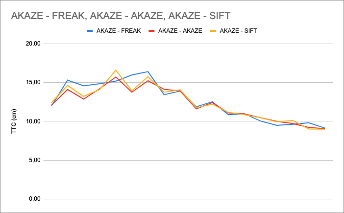

# HOW to track 3D objects and estimate Time To Collision

## FP1. Match 3D objects

The Yolov3 deep learning model detect objects in the scene (2D image), each detected object is enclosed in a bounding box. In order to track objects in the scene over time, we need to track those bounding boxes. By matching bounding boxes in consecutives images, we know that we are working with the same object evolving in the environment. In the preceding vehicle case, we will be able to estimate the Time To Collision because we can calculate the distance to the vehicle over time (at each frame).

## FP2. Compute Lidar-based TTC

Lidar measurement give us directly a measurement of distance. After filtering, segmentation and croping we can track the nearest lidar point on the preceding vehicle to estimate the TTC.
Filtering out unwanted Lidar Points is primordial in order to reach a good estimation of the TTC. For example, in some cases lidar points pop in front of the rest of the pointcloud, this causes the distance calculation to be innacurate and thus the TTC estimation is false or way off.

## FP3. Associate Keypoint Correspondences with Bounding Boxes

In order to compute the Camera-based TTC, we need keypoints associated to the preceding vehicle. In other words we need to associate keypoints to regions of interest defined by bounding boxes.

## FP4. Compute Camera-based TTC

From keypoints detected on the preceding vehicle we can calculate for each frame the distance between all keypoints. While approaching the preceding vehicle this distance will grow over time, so the ratio of distance in current frame by the distance in previous frame will grow.

## FP5. Performance Evaluation 1: TTC Lidar

When is the Lidar based TTC estimate way off ?

we have 2 examples where the variation of the estimated TTC is quite strong:

- Image index 3 to image index 4, the difference on xmin is almost 2 times higher compared to previous estimation. We have a difference of 11 cm compared to 6 cm in average on previous estimations. This quite high difference implies a high brake speed estimated for the preceding vehicle and a lower Time To collision of 7,12 seconds. This estimation is 45% lower than the mean of previous estimations.


we can see that a point is a little in advance from others. This might be the cause of this sudden higher difference. In the outliers removal phase, all points further than 18cm from the median value are removed. A lower threshold could fix the problem is this case.


_ Image index 6 to image index 7, the difference on xmin is very low, almost 2 times smaller compared to previous estimation.  We have a difference of 3cm compared to 6,5cm in average on previous estimations. In this case, a low difference estimated implies a low brake speed estimated for the preceding vehicle and a higher TTC of 34,34 seconds. This estimation is 274% higher than the mean of previous estimations.


We can see that the boundingboxes are very close to each other, this means that the variation in distance to the ego vehicle is very low. This explain why a such high TTC is estimated.

All data used for this interpretation are available in ```performance_data/FP5.pdf```.

## FP6. Performance Evaluation 2: TTC Camera

We ran all detector / descriptor combinations in order to look at differences in TTC estimation. 

We want combinations that offer a steady TTC estimation (without sudden spike or erroneous values) and with a progressive negative slope (that reflects the approach to the preceding vehicle).

We found 7 combinations that work pretty well, compared in the following graph:


 among those the best three are the following:

- AKAZE detector - SIFT descriptor
- AKAZE detector - FREAK descriptor
- AKAZE detector - AKAZE descriptor




We can observe that it is the AKAZE detector that estimates the better TTC. A ground truth is needed to be more accurate on the combinations comparaison and finding the best combination.
From Middle Term Project, we have seen that the AKAZE detector is quite slow. In the case we want to choose a combination applicable in a embedded environment, it is more suitable to pick the following combination:

- SIFT detector - BRIEF descriptor

This combination is in top 7 without using AKAZE detector.

All data used for this interpretation are available in ```performance_data/FP6.pdf```.

# Dependencies

- [OpenCV](https://docs.opencv.org/4.x/df/d65/tutorial_table_of_content_introduction.html)

# Compile and run

Retrieve the source code:
```
git clone https://github.com/sando92/3D_object_tracking.git
```

Create the build directory at root and enter it:
```
cd 3D_object_tracking
mkdir build
cd build
```

Compile the project:
```
cmake .. && make
```

And finally run it:
```
./3D_object_tracking
```
