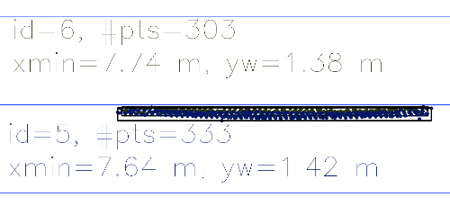
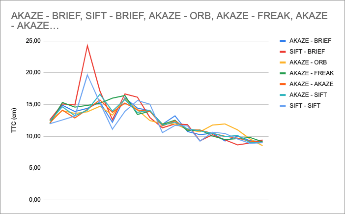

# HOW to track 3D objects and estimate Time To Collision

## FP1. Match 3D objects

The Yolov3 deep learning model detects objects in the scene (2D image), each detected object is enclosed in a bounding box. In order to track objects in the scene over time, we need to track those bounding boxes. By matching bounding boxes in consecutive images, we know that we are working with the same object evolving in the environment. In the preceding vehicle case, We will be able to estimate the Time To Collision because we can calculate the distance to the vehicle over time (at each frame).

## FP2. Compute Lidar-based TTC

Lidar data give us directly a measurement of distance. After segmentation, cropping, and filtering we can track the nearest lidar point of the preceding vehicle to estimate the TTC.
Filtering out unwanted Lidar Points is primordial in order to reach a good estimation of the TTC. For example, in some cases lidar points pop in front of the rest of the point cloud, this causes the distance calculation to be inaccurate and thus the TTC estimation is false or way off. We use the "1.5xIQR rule" to filter out outliers on the X axis, IQR stands for Inter Quartile Range.

## FP3. Associate Keypoint Correspondences with Bounding Boxes

In order to compute the Camera-based TTC, we need key points associated with the preceding vehicle. In other words, we need to associate key points to regions of interest defined by bounding boxes.  We use the "1.5xIQR rule" to filter out outliers, based on the distance of each match.

## FP4. Compute Camera-based TTC

From key points detected on the preceding vehicle we can calculate for each frame the distance between all key points. While approaching the preceding vehicle this distance will grow over time, so the ratio of distance in current frame by the distance in previous frame will grow.

## FP5. Performance Evaluation 1: TTC Lidar

We have multiple cases, looking at consecutive estimation of the TTC, where the variation is quite strong:

- Image index 4 to image index 5, the difference on xmin is almost 2 times higher compared to previous estimation. We have a difference of 10,3 cm compared to 5,82 cm in average on previous estimations. This quite high difference represents the preceding vehicle quickly braking and thus a lower Time To collision of 7,42 seconds. This estimation is 45% lower than the mean of previous estimations.



From the image above, we can see that the outlier removal was successful. The strong variation in the TTC estimation seems to be normal, taken the chosen method and the data input.


- Image index 6 to image index 7, the difference on xmin is very low, almost 2 times smaller compared to previous estimation. We have a difference of 2,2cm compared to 6,6cm in average on previous estimations. In this case, a low difference estimated represents a low braking speed of the preceding vehicle and a higher TTC of 34,34 seconds. This estimation is 274% higher than the mean of previous estimations.


We can see that the bounding boxes are very close to each other, this means that the variation in distance to the ego vehicle is very low. This explains why such high TTC is estimated.

Those variations in the TTC estimation are in part due to the used method. The results shown above are estimated using the Constant Velocity Model (CVM) and suppose that the relative velocity between the ego vehicle and the preceding vehicle is constant. The implementation of a Constant acceleration model (CAM) could fix those observations.

All data used for this interpretation are available in ```performance_data/FP5.pdf```.

## FP6. Performance Evaluation 2: TTC Camera

We ran all detector / descriptor combinations in order to look at differences in TTC estimation. 

We want combinations that offer a steady TTC estimation (without sudden spike or erroneous values) and with a progressive negative slope (that reflects the approach to the preceding vehicle).

We found 7 combinations that work pretty well, compared in the following graph:



Among those, the best three are the following:

- AKAZE detector - FREAK descriptor
- AKAZE detector - AKAZE descriptor
- AKAZE detector - SIFT descriptor


We can observe that it is the AKAZE detector that estimates the better TTC. A ground truth is needed to be more accurate on the combinations comparison and finding the best combination.
From Middle Term Project, we have seen that the AKAZE detector is quite slow. In the case we want to choose a combination applicable in an embedded environment, it is more suitable to pick the following combination:

- SIFT detector - BRIEF descriptor

This combination is in the top 7 without using AKAZE detector.

Like mentioned before, the implementation of a CAM instead of a CVM for the TTC estimation could lead to better results and thus a more appropriate choice of the best detector descriptor combination.

All data used for this interpretation are available in ```performance_data/FP6.pdf```.

# Dependencies

- [OpenCV](https://docs.opencv.org/4.x/df/d65/tutorial_table_of_content_introduction.html)

# Compile and run

Retrieve the source code:
```
git clone https://github.com/sando92/3D_object_tracking.git
```

Create the build directory at root and enter it:
```
cd 3D_object_tracking
mkdir build
cd build
```

Compile the project:
```
cmake .. && make
```

And finally run it:
```
./3D_object_tracking
```
